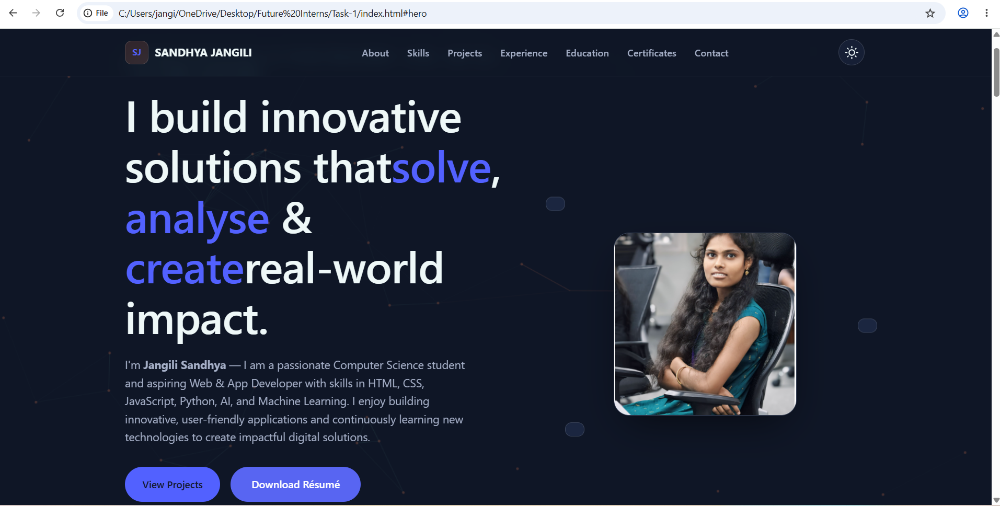
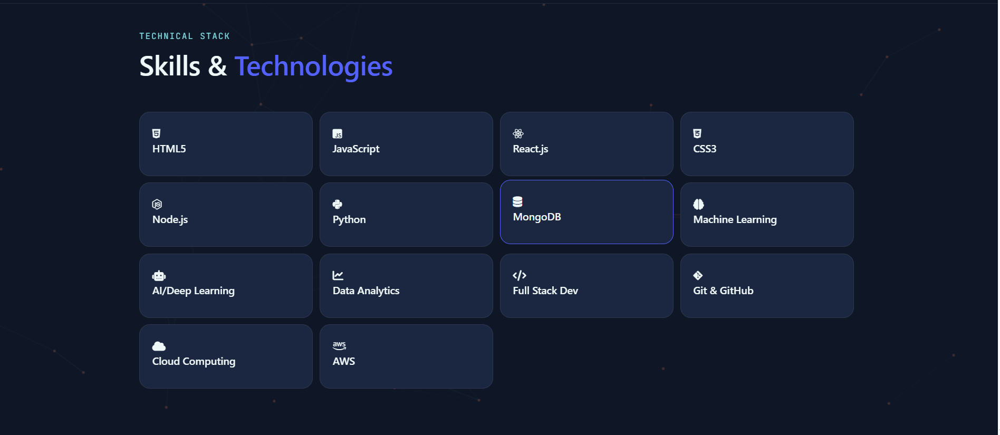

# 🌟 Personal Portfolio Website

## 📖 Overview
This is my personal portfolio website developed to showcase my skills, projects, experience, and achievements in Web Development, Python Programming, AI/ML, and App Development.

## 📸 Website Preview

## 📌 Features

- 🎨 Modern and Responsive UI
- 🌙 Dark & Light Theme Toggle
- 📱 Mobile-Friendly Navigation
- 💻 Hero Section with Introduction
- 👩‍🎓 About Me Section
- 🛠 Skills Section
- 📂 Projects Showcase
- 📜 Certificates & Achievements
- 🎓 Education Timeline
- 📞 Contact Form
- ✨ Interactive Background Animation
- ⚡ Smooth Scrolling & Hover Effects
### Portfolio Sections

## 🛠️ Technologies Used
- HTML5
- CSS3
- JavaScript
- Font Awesome
- Google Fonts

## 📂 Project Structure

Portfolio/
│
├── index.html
├── style.css
├── script.js
├── assets/
│   ├── images/
│   │   └── portfolio-image.png
│   └── resume.pdf
└── README.md

## 💡 About Me
I am **Jangili Sandhya**, a Computer Science student passionate about Python Development, AI/ML, Web Development, and App Development. I enjoy building innovative solutions that solve real-world problems and continuously expanding my technical skills.

## 🎯 Objectives
- Showcase technical skills and projects
- Create a professional online presence
- Demonstrate frontend development abilities
- Provide recruiters with easy access to my work and resume

## 📚 Learning Outcomes
- Responsive Web Design
- UI/UX Development
- JavaScript DOM Manipulation
- Theme Switching Implementation
- Portfolio Website Development

## ▶️ How to Run
1. Clone or download this repository.
2. Open the project folder.
3. Run `index.html` in any web browser.

## 👩‍💻 Author

**Jangili Sandhya**
- B.Tech Computer Science Student
- Python Developer
- Frontend Developer
- AI/ML Enthusiast

### Connect With Me
- LinkedIn: www.linkedin.com/in/jangili-sandhya
- GitHub: [github.com/jangilisandhya](https://github.com/jangilisandhya)

⭐ Thank you for visiting my portfolio website!
